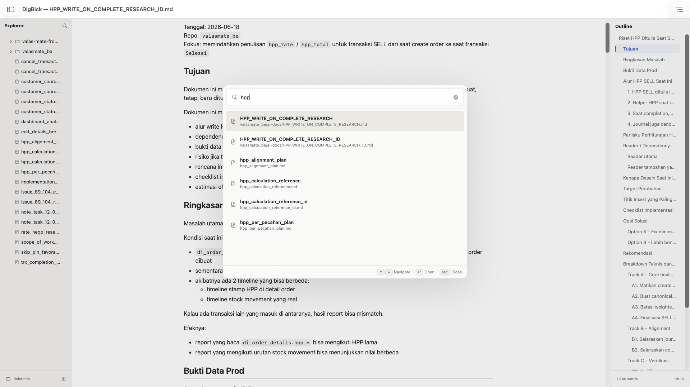

# DigBick

A fast, beautiful Markdown viewer for macOS.



## What it is

DigBick is Preview.app for Markdown.

No vaults. No plugins. No editing. No AI. No sync. No telemetry.  
Just Markdown, rendered beautifully.

---

## Features

### Core Viewer
- **Viewer Only** — no editing, no plugins, no vaults
- **Formats** — opens `.md`, `.markdown`, and `.mdown`
- **GitHub-style rendering** — clean typography, code blocks, tables, task lists
- **Dark mode** — full system dark/light mode support
- **Local assets** — resolves local images relative to the document
- **Auto reload** — instantly updates when the file changes externally

### Workspace
- **File sidebar** — open any folder as a workspace (`⇧⌘O`), browse the Markdown file tree
- **Collapsible folders** — tree defaults collapsed; expand manually, state is preserved
- **Table of Contents** — outline sidebar with clickable headings (`⌘T`)
- **Scroll memory** — remembers your scroll position per file

### Search
- **Quick Open** (`⌘P`) — command palette to find any Markdown file by name or path
  - Type a filename to search by name
  - Type a `/` to search by relative path (e.g. `docs/setup`)
  - Keyboard navigation: `↑ ↓` move, `↵` open, `esc` close
- **Find in Document** (`⌘F`) — search text inside the currently open rendered document
  - `⌘G` / `⇧⌘G` to jump between matches
  - `esc` closes the find bar and clears highlights

### Design
- Warm neutral macOS palette — not a web app wrapped in a window
- Responsive Quick Open palette scales to window and fullscreen size
- Reading Mode — strips all sidebars for focused reading
- Zero telemetry, zero analytics, zero network requests

---

## Getting Started

### Quick Build (No Xcode Required)

If you have macOS Command Line Tools installed:

```sh
./build.sh
```

This generates `DigBick.app` in the project folder. Double-click to run.

### Xcode Build

Open `DigBick.xcodeproj`, select the `DigBick` scheme targeting **My Mac**, and press `⌘R`.

---

## Keyboard Shortcuts

| Shortcut | Action |
|---|---|
| `⌘P` | Quick Open — search files by name or path |
| `⌘F` | Find in document |
| `⌘G` | Find next match |
| `⇧⌘G` | Find previous match |
| `⌘T` | Toggle Table of Contents sidebar |
| `⇧⌘O` | Open workspace folder |
| `⌘R` | Reload current file |

---

## Privacy

DigBick does not collect analytics, telemetry, or personal data.  
All parsing and rendering happens locally on your device.  
No network requests are made.

---

## Support

DigBick is, and always will be, completely free and open-source.  
If you find it useful, you can buy me a coffee!

[](https://paypal.me/satriyobud)

---

## License

MIT
